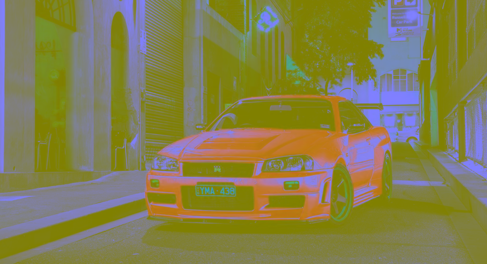

# Color Conversion
## AIM
To perform the color conversion between RGB, BGR, HSV, and YCbCr color models.

## Software Required:
Anaconda - Python 3.7
## Algorithm:
### Step1:
<br>

### Step2:
<br>

### Step3:
<br>

### Step4:
<br>

### Step5:
<br>

## Program:

# Developed By:javith farkhan S
# Register Number:212221240017
# i) original_image
```
import cv2
uni = cv2.imread('gtr.jpg')
cv2.imshow('Original image',uni)
cv2.waitKey(0)
cv2. destroyAllWindows()

```
# ii)Convert BGR to HSV
```
import cv2
uni = cv2.imread('gtr.jpg')
hsv_image = cv2.cvtColor(uni, cv2.COLOR_BGR2HSV)
cv2.imshow('BGR2HSV' ,hsv_image )
cv2.waitKey(0)
cv2. destroyAllWindows()
```
# iii)Convert HSV to RGB
```
import cv2
uni = cv2.imread('gtr.jpg')
RGB_image = cv2.cvtColor(uni,cv2.COLOR_HSV2RGB)
cv2.imshow('HSV to RGB',RGB_image )
cv2.waitKey(0)
cv2.destroyAllWindows()
```
# iv)convert HSV to BGR
```
import cv2
uni = cv2.imread('gtr.jpg')
BGR_image = cv2.cvtColor(uni,cv2.COLOR_HSV2BGR)
cv2.imshow('HSV to BGR',BGR_image)
cv2.waitKey(0)
cv2.destroyAllWindows()
```
# v) convert RGB to YCrCb
```
import cv2
uni = cv2.imread('gtr.jpg')
YCrCb_image = cv2.cvtColor(uni, cv2.COLOR_RGB2YCrCb)
cv2.imshow('RGB2YCrCb',YCrCb_image)
cv2.waitKey(0)
cv2.destroyAllWindows()
```
# vi) convert BGR to YCrCb
```
import cv2
uni = cv2.imread('gtr.jpg')
YCrCb_image = cv2.cvtColor(uni, cv2.COLOR_BGR2YCrCb)
cv2.imshow('BGR2YCrCb',YCrCb_image)
cv2.waitKey(0)
cv2.destroyAllWindows()
```
# vii) Merged BGR Image
```
import cv2
uni = cv2.imread('gtr.jpg')
blue=uni[:,:,0]
green=uni[:,:,1]
red=uni[:,:,2]
cv2.imshow('B-Channel',blue)
cv2.imshow('G-Channel',green)
cv2.imshow('R-Channel',red)

merged_BGR=cv2.merge((blue,green,red))
cv2.imshow('Merged BGR Image',merged_BGR)
cv2.waitKey(0)
cv2.destroyAllWindows()
```
# viii) Split HSV
```
import cv2
uni = cv2.imread('gtr.jpg')
hsv=cv2.cvtColor(uni,cv2.COLOR_BGR2HSV)
h,s,v=cv2.split(hsv)
cv2.imshow("Hue-image",h)
cv2.imshow("Saturation-image",s)
cv2.imshow("gray-image",v)
```
# xi) Merge HSV
```
import cv2
Merged_HSV=cv2.merge((h,s,v))
cv2.imshow('Merged HSV Image',Merged_HSV)
cv2.waitKey(0)
cv2.destroyAllWindows()
```


## Output:
### i)original_image
<br>


<br>


### ii)Convert BGR to HSV




### iii)Convert HSV to RGB
<br>
<br>


### iv)convert HSV to BGR
<br>
<br>


### v) convert RGB to YCrCb
<br>
<br>


### vi)convert BGR to YCrCb
<br>
<br>


### vii)Merged BGR Image
<br>
<br>


### viii)Split HSV
<br>
<br>


### xi) Merge HSV
<br>
<br>


## Result:
Thus the color conversion was performed between RGB, HSV and YCbCr color models.
